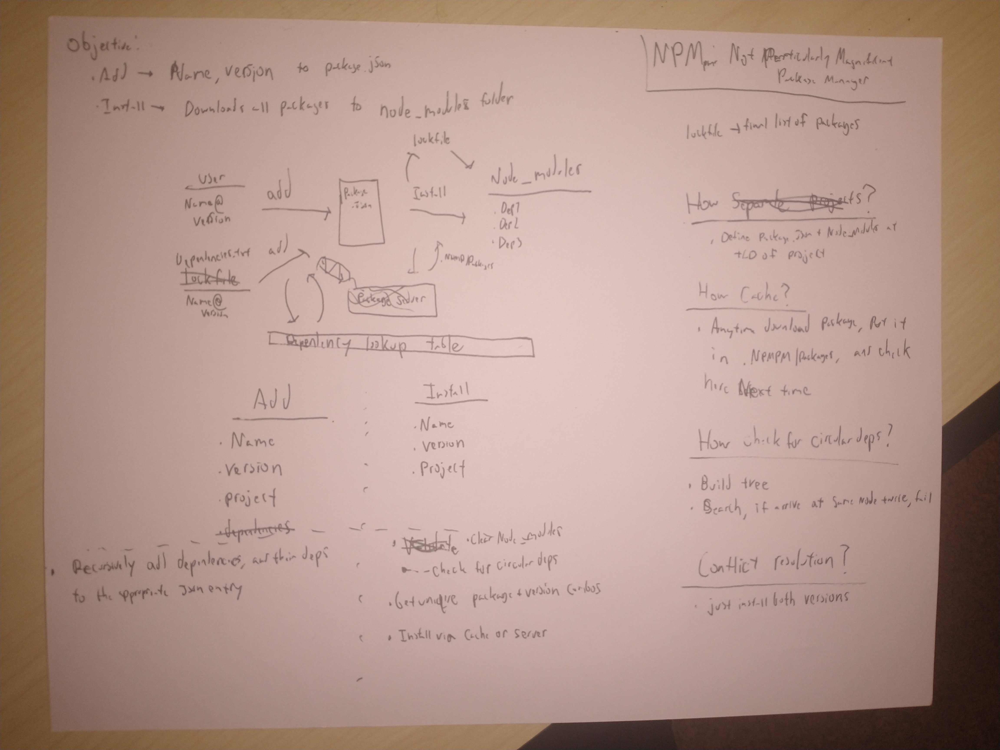

# Not Particularly Magnificent Package Manager



## Objective
The purpose of this project is to manage packages by adding and installing dependencies effectively. This includes:
1. Adding dependencies to the `package.json` file.
2. Installing all packages into the `node_modules` folder.

## Usage

From your project's top level directory:

### Add a Package
To add a package to your project, use the `add` command:
```sh
python path/to/npmpm.py add <package-name>@<version>
```

### Install all packages
To install all added packages, use the `install` command:
```sh
python path/to/npmpm.py install
```


